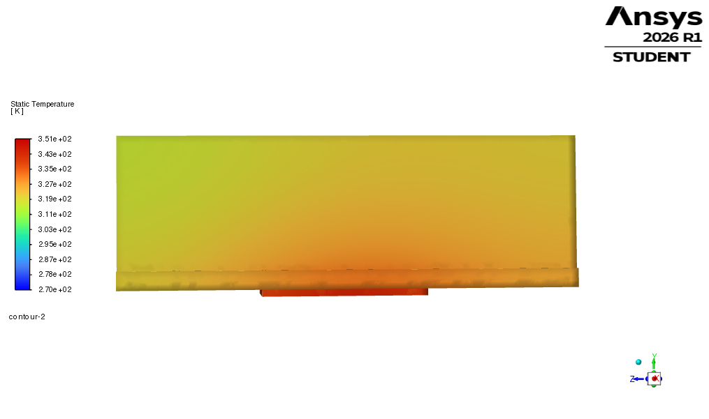
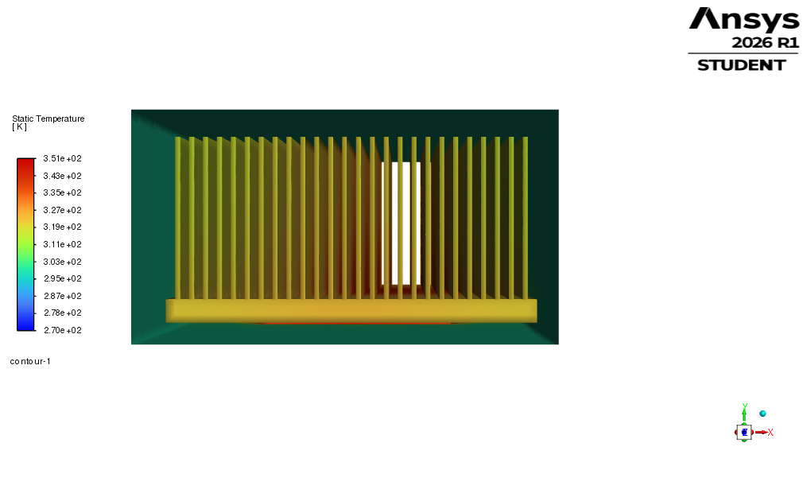
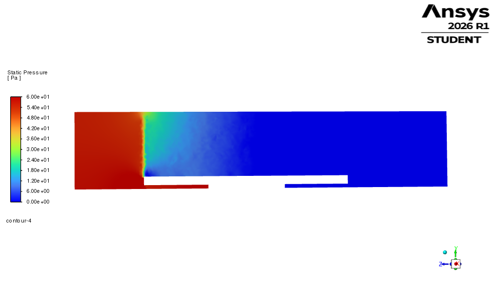

# CFD-4A Refined-Mesh Sensitivity Case

## Purpose

This folder contains the CFD-4A refined-mesh repeat of the final CFD-3 ducted heatsink case.

The purpose of CFD-4A is to check whether the final 250 W forced-air cooling result remains thermally feasible when the mesh is refined.

This is a mesh-sensitivity check only. It is not a full mesh-independent CFD validation.

---

## Case description

| Quantity | Value |
|---|---:|
| Heatsink geometry | 80 × 120 × 35 mm |
| Domain type | Ducted |
| Chip heat load | 250 W |
| Inlet air velocity | 5 m/s |
| Inlet air temperature | 25 °C |
| Solver model | Laminar |
| Iterations | 700 |

The geometry, materials, heat load, and boundary conditions were kept the same as CFD-3. Only the mesh was refined.

---

## Mesh summary

| Mesh quantity | CFD-4A value |
|---|---:|
| Nodes | 191,534 |
| Elements | 511,566 |
| Maximum aspect ratio | 10.716 |
| Minimum element quality | 0.186 |
| Minimum orthogonal quality | 0.201 |

The refined mesh has approximately 2.7 times more elements than the CFD-3 baseline mesh.

---

## Main results

| Quantity | CFD-4A result |
|---|---:|
| Maximum chip temperature | 78.11 °C |
| Average chip temperature | 73.14 °C |
| Outlet mass-weighted temperature | 35.98 °C |
| Pressure drop | 56.36 Pa |
| Mass imbalance | approximately 0.00146% |
| Energy balance error | approximately 0.2% |
| Reversed flow at outlet | approximately 0.5% outlet area |

---

## Comparison with CFD-3

| Quantity | CFD-3 baseline | CFD-4A refined mesh | Change |
|---|---:|---:|---:|
| Elements | 187,932 | 511,566 | 2.7× finer |
| Maximum chip temperature | 83.52 °C | 78.11 °C | -5.41 °C |
| Average chip temperature | 78.77 °C | 73.14 °C | -5.63 °C |
| Outlet temperature | 35.96 °C | 35.98 °C | +0.02 °C |
| Pressure drop | 49.02 Pa | 56.36 Pa | +7.34 Pa |

---

## Interpretation

The refined-mesh case still predicts that the final ducted heatsink design passes the 85 °C chip-temperature target.

However, the maximum chip temperature changed by approximately 5.4 °C compared with CFD-3. Therefore, the result should be treated as a mesh-sensitivity check, not as proof of full mesh independence.

The CFD-4A result supports the thermal feasibility of the final design, but further mesh refinement, near-wall/interface checks, and turbulence or transition sensitivity would be required before claiming validated CFD performance.

---

## Visualization note

The temperature result is shown using solid component surfaces for clarity. A centre cut plane through the fin array can appear fragmented because it intersects many thin fins, air gaps, and solid-fluid interfaces.

An additional isometric solid-surface temperature image is included to show the refined-mesh thermal distribution across the heatsink fins, base, and chip region.

---

## Result images

### Temperature on solid surfaces



### Isometric temperature view



### Static pressure on centre X-plane



---

## Files
## Files

```text
results/README.md

screenshots/cfd_4a_temperature_solid_surfaces.png
screenshots/cfd_4a_temperature_isometric_solid_surfaces.png
screenshots/cfd_4a_static_pressure_center_x_plane.png
```

The Fluent case/data files were generated locally but are not included in the GitHub repository because they exceed the normal GitHub web-upload file-size limit.
