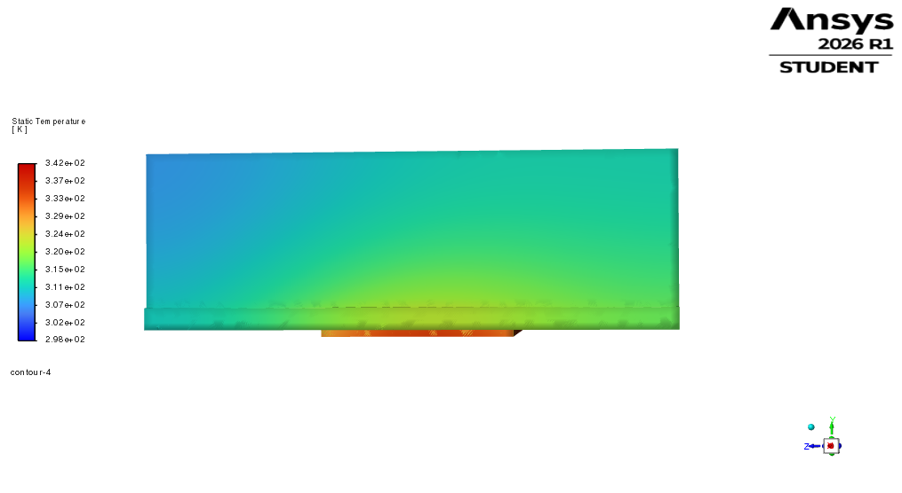
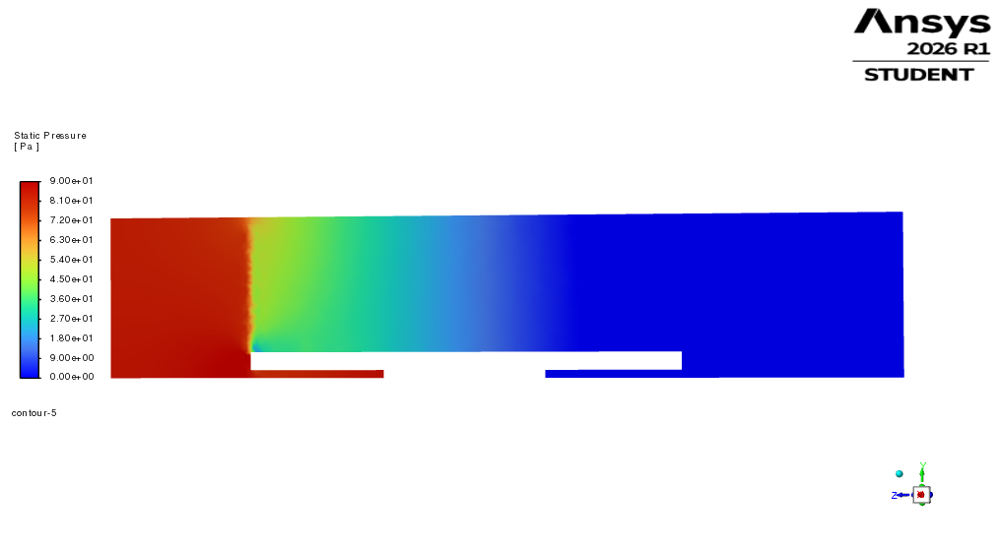

# CFD-4B k-omega SST Sensitivity Case

## Purpose

This folder contains the CFD-4B turbulence-model sensitivity case for the final ducted heatsink design.

The purpose of CFD-4B is to compare the refined laminar CFD-4A result with a k-omega SST turbulence-model result.

This is a viscous-model sensitivity check only. It is not a final validated turbulence-model prediction.

---

## Case description

| Quantity | Value |
|---|---:|
| Heatsink geometry | 80 × 120 × 35 mm |
| Domain type | Ducted |
| Chip heat load | 250 W |
| Inlet air velocity | 5 m/s |
| Inlet air temperature | 25 °C |
| Mesh | CFD-4A refined mesh |
| Viscous model | k-omega SST |
| Turbulence intensity | 5% |
| Turbulent viscosity ratio | 10 |
| Iterations | 700 |

The geometry, mesh, materials, heat load, and boundary conditions were kept the same as CFD-4A. Only the viscous model was changed from laminar to k-omega SST.

---

## Mesh summary

| Mesh quantity | CFD-4B value |
|---|---:|
| Nodes | 191,534 |
| Elements | 511,566 |
| Maximum aspect ratio | 10.716 |
| Minimum element quality | 0.186 |
| Minimum orthogonal quality | 0.201 |

---

## Main results

| Quantity | CFD-4B result |
|---|---:|
| Maximum chip temperature | 68.50 °C |
| Average chip temperature | 63.58 °C |
| Outlet mass-weighted temperature | 35.99 °C |
| Pressure drop | 83.84 Pa |
| Mass imbalance | approximately 0.00274% |
| Energy balance error | approximately 0.1% |

---

## Comparison with refined laminar case

| Quantity | CFD-4A refined laminar | CFD-4B k-omega SST | Change |
|---|---:|---:|---:|
| Maximum chip temperature | 78.11 °C | 68.50 °C | -9.61 °C |
| Average chip temperature | 73.14 °C | 63.58 °C | -9.56 °C |
| Outlet temperature | 35.98 °C | 35.99 °C | +0.01 °C |
| Pressure drop | 56.36 Pa | 83.84 Pa | +27.48 Pa |

---

## Interpretation

The k-omega SST case predicts stronger cooling than the refined laminar case, reducing the maximum chip temperature from 78.11 °C to 68.50 °C.

The SST case also predicts a higher pressure drop, increasing from 56.36 Pa to 83.84 Pa.

This suggests that the turbulence model adds stronger momentum and thermal mixing. The final ducted heatsink design remains below the 85 °C target under both laminar and SST assumptions.

However, the difference between the two cases is significant. Therefore, CFD-4B should be treated as a turbulence-model sensitivity check, not as final validated CFD performance.

Further transition/turbulence assessment, near-wall checks, mesh refinement, and experimental correlation would be required before claiming product-level validation.

---

## Visualization note

The temperature visualization is shown on the solid component surfaces for clarity. A centre cut plane through the fin array can look fragmented because it intersects many thin fins, air gaps, and solid-fluid interfaces.

The pressure visualization is shown on a centre X-plane using a manual static-pressure range of 0 to 90 Pa, consistent with the CFD-4B pressure drop of approximately 83.84 Pa.

---
## Result images

### Temperature on solid surfaces



### Static pressure on centre X-plane



## Files

```text
results/README.md

screenshots/cfd_4b_temperature_solid_surfaces.png
screenshots/cfd_4b_static_pressure_center_x_plane.png
