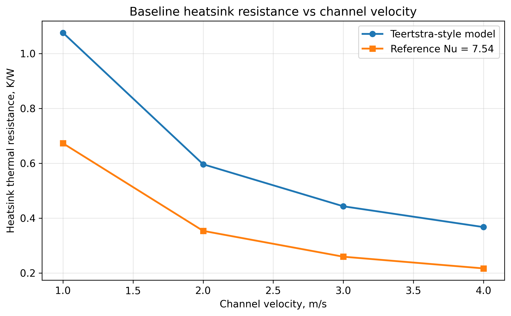
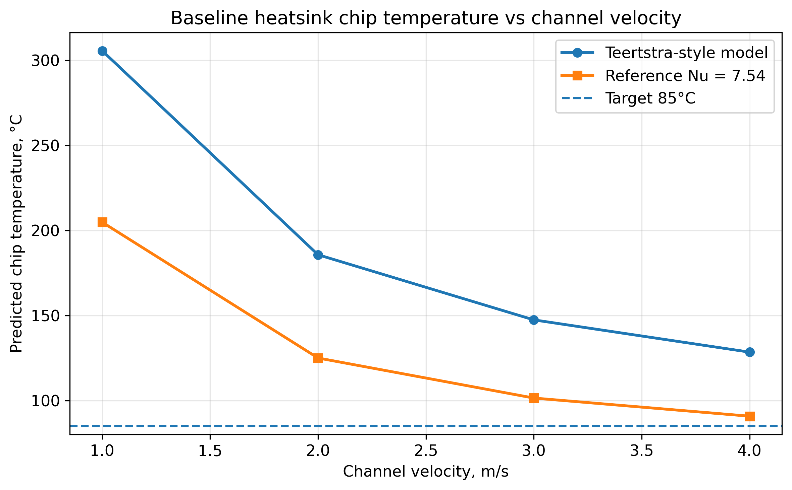
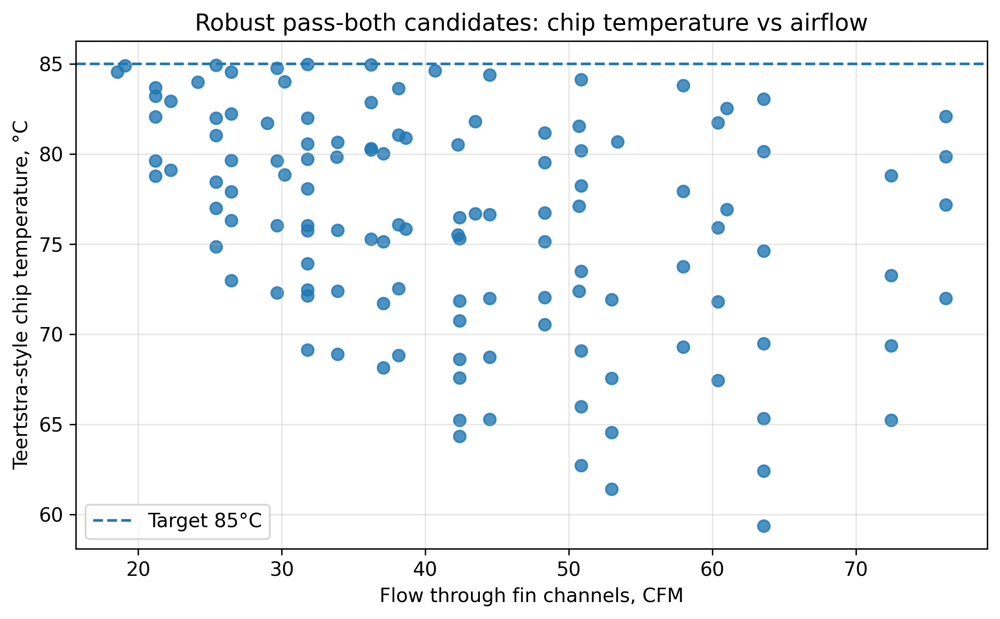
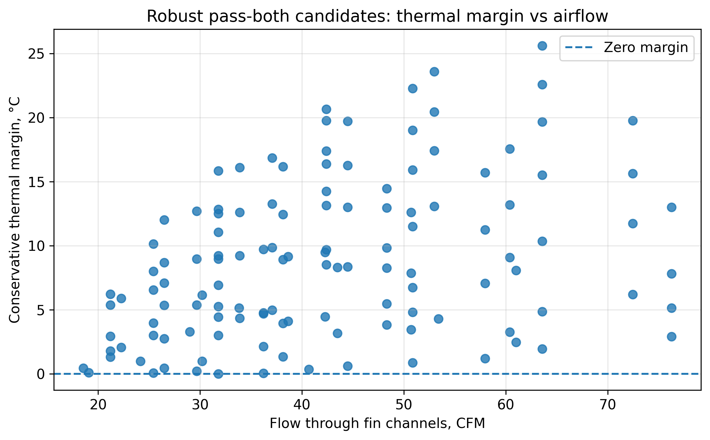
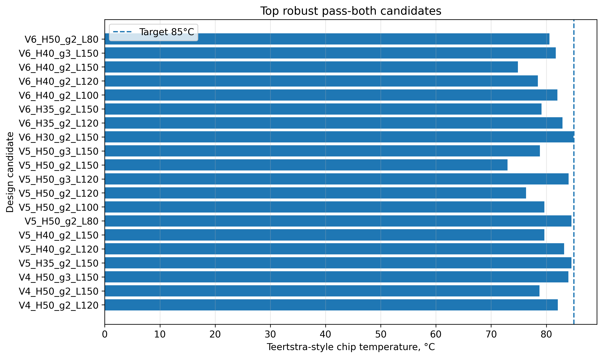
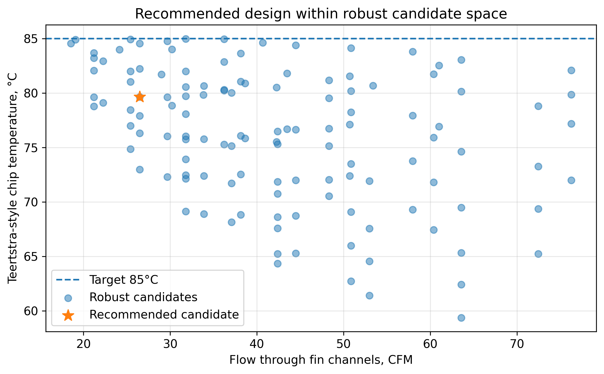

\# Analytical Screening Summary


\## Purpose


This document summarizes the analytical screening work completed before the first CFD model.


The purpose of the analytical stage was to avoid jumping directly into CFD. The calculations were used to identify whether the cooling problem was physically feasible, which design variables controlled the result, and which heatsink architecture should be taken into the first 3D conjugate heat-transfer simulation.


The analytical screening covered:


\- required chip-to-air thermal resistance

\- TIM sensitivity

\- airflow heat-capacity sanity check

\- compact forced-air heatsink model

\- forced-air heatsink design sweep

\- passive/fanless screening

\- vapor-chamber/spreading assessment

\- cooling architecture tradeoff

\- selection of the CFD 0 candidate


\## Design Target


| Quantity | Value |

|---|---:|

| Chip heat load | 250 W |

| Inlet / ambient air temperature | 25 °C |

| Target maximum chip temperature | 85 °C |

| Allowed chip temperature rise | 60 °C |

| Required chip-to-air thermal resistance | 0.240 K/W |

| Baseline TIM thickness | 0.2 mm |

| Baseline TIM conductivity | 6 W/mK |

| Baseline TIM resistance | approximately 0.0165 K/W |


The required chip-to-air thermal resistance was calculated as:


```text

R\_required = (T\_chip,max - T\_air,inlet) / Q\_chip


R\_required = (85 - 25) / 250


R\_required = 0.240 K/W

```


This means the complete chip-to-air thermal path, including TIM, base/spreading, and heatsink-to-air resistance, must remain below approximately 0.240 K/W.


\## TIM Sensitivity


A TIM sensitivity study was performed to check the effect of TIM thickness and thermal conductivity.


| TIM case | Thickness | Conductivity | Result |

|---|---:|---:|---|

| Thin low-k TIM | 0.1 mm | 3 W/mK | Pass |

| Baseline TIM | 0.2 mm | 6 W/mK | Pass |

| Thick high-k TIM | 0.5 mm | 8 W/mK | Pass |

| Degraded thick TIM | 0.5 mm | 3 W/mK | Fail |

| High-performance thin TIM | 0.1 mm | 8 W/mK | Pass |


Main conclusion:


The baseline TIM assumption is acceptable, but a thick low-conductivity TIM can consume a large part of the available thermal margin. TIM bond-line thickness and conductivity must therefore be controlled in the mechanical design.


\## Airflow Heat-Capacity Check


An airflow heat-capacity sanity check was performed before detailed heatsink modelling.


The goal was to check whether the assumed airflow could physically carry away the heat load.


The air-side heat capacity relation was:


```text

Q\_air = m\_dot × cp × (T\_out - T\_in)

```


This check showed that low airflow rates lead to excessive air temperature rise, especially for the full 320 W board heat load.


Main conclusion:


The cooling concept requires strong guided airflow. A thermal resistance target alone is not enough; the airflow must also have enough heat capacity to remove the chip and board heat.


\## Compact Forced-Air Heatsink Screening


The initial compact forced-air heatsink was:


| Quantity | Value |

|---|---:|

| Heatsink base | 80 mm × 80 mm |

| Fin height | 25 mm |

| Fin thickness | 1 mm |

| Fin spacing | 2 mm |

| Chip heat load | 250 W |


The compact forced-air model was evaluated over channel velocities from 1 to 4 m/s using two air-side heat-transfer estimates:


\- Teertstra-style developing-channel model

\- Reference fully developed laminar model with Nu = 7.54


Both models showed that the compact heatsink remained above the 85 °C chip target.


Main conclusion:


The compact 80 mm × 80 mm × 25 mm heatsink is not sufficient for the 250 W chip load. Increasing airflow helps, but the compact fin stack still does not provide enough effective air-side heat rejection.


\## Forced-Air Heatsink Design Sweep


A larger forced-air heatsink design sweep was performed by varying:


\- channel velocity

\- fin height

\- fin spacing

\- heatsink length

\- number of fins

\- effective heat-transfer model


The full sweep contained 1280 design cases.


From these, 403 cases passed at least one analytical model, and 125 robust candidates passed both the conservative and reference models.


The robust pass-both candidates were used to select the first CFD geometry.


\## Selected Analytical Candidate


The selected candidate for CFD 0 was:


| Quantity | Value |

|---|---:|

| Heatsink base | 80 mm × 100 mm |

| Base thickness | 5 mm |

| Fin height | 50 mm |

| Fin thickness | 1 mm |

| Fin spacing | 2 mm |

| Number of fins | 26 |

| Channel velocity | 5 m/s |

| Flow through fin channels | approximately 26.5 CFM |

| Chip heat load | 250 W |


The analytical result for this candidate was approximately:


| Quantity | Analytical estimate |

|---|---:|

| Chip temperature | approximately 82.4 °C |

| Pressure drop | approximately 30 Pa |

| Thermal status | Pass |

| Margin to 85 °C target | approximately 2.6 °C |


Main conclusion:


The 80 mm × 100 mm × 50 mm forced-air heatsink was the first architecture that met the 85 °C target analytically with reasonable pressure drop.


\## Passive / Fanless Screening


Passive cooling was evaluated using natural convection and radiation.


Two geometries were checked:


| Geometry | Passive heat rejection at 85 °C |

|---|---:|

| Compact 80 mm × 80 mm × 25 mm | approximately 25.1 W |

| Larger 80 mm × 100 mm × 50 mm | approximately 37.9 W |


The required chip heat rejection is 250 W.


Even the best passive case removes only:


```text

37.9 / 250 ≈ 15 %

```


of the required chip heat load.


Main conclusion:


Passive/fanless cooling is not feasible for the 250 W chip case. Forced airflow is required.


\## Vapor Chamber / Spreading Assessment


A vapor chamber was not modelled as a detailed two-phase device. Instead, it was represented as an equivalent high in-plane-conductivity spreader.


The spreading analysis checked whether better lateral spreading could rescue the compact heatsink or significantly improve the selected larger heatsink.


For the compact case, copper or vapor-chamber spreading did not solve the problem because the dominant resistance was the air-side heatsink resistance.


For the selected larger 80 mm × 100 mm candidate, spreading improvements were modest.


Approximate spreading comparison:


| Spreader / base type | Approximate chip temperature |

|---|---:|

| Aluminum 6061 | 82.4 °C |

| High-k aluminum | 82.0 °C |

| Copper spreader | 80.9 °C |

| Vapor chamber conservative | 81.0 °C |

| Vapor chamber baseline | 80.4 °C |

| Vapor chamber optimistic | 80.2 °C |


Main conclusion:


Copper or vapor-chamber spreading improves thermal margin by a few degrees, but it does not replace the need for sufficient airflow and fin area.


The dominant bottleneck is air-side heat rejection through the fin stack, not chip-to-base spreading.


\## Cooling Architecture Tradeoff


The analytical screening compared four main cooling architectures:


| Architecture | Result |

|---|---|

| Passive / fanless cooling | Rejected |

| Compact forced-air heatsink | Rejected |

| Compact heatsink with copper/vapor chamber | Rejected |

| Larger forced-air heatsink | Selected |

| Larger forced-air with optional copper/vapor chamber | Possible future margin improvement |


Final architecture selected for CFD 0:


```text

80 mm × 100 mm × 50 mm forced-air aluminum heatsink

26 fins

1 mm fin thickness

2 mm fin spacing

5 m/s guided inlet airflow

250 W chip heat load

```


\## Analytical to CFD Connection


The analytical result for the selected CFD 0 candidate was:


| Quantity | Analytical estimate |

|---|---:|

| Chip temperature | approximately 82.4 °C |

| Pressure drop | approximately 30 Pa |


The first-pass CFD result gave:


| Quantity | CFD 0 result |

|---|---:|

| Maximum chip temperature | approximately 76.0 °C |

| Pressure drop | approximately 28.8 Pa |

| Energy balance error | approximately 0.9% |


The CFD pressure drop agrees closely with the analytical estimate. The CFD chip temperature is lower than the analytical estimate by approximately 6.4 °C, which is acceptable for a first-pass comparison because the analytical model was intentionally simplified and conservative.


## Key Analytical Figures

The following plots support the analytical screening.

### Compact Baseline Thermal Resistance



### Compact Baseline Chip Temperature



### Robust Candidates: Airflow versus Chip Temperature



### Robust Candidates: Thermal Margin versus Airflow



### Top Robust Candidates



### Recommended Candidate Location




These figures show:


\- compact baseline heatsink resistance versus channel velocity

\- compact baseline chip temperature versus channel velocity

\- robust candidate chip temperature versus airflow

\- robust candidate thermal margin versus airflow

\- top robust pass-both candidates

\- selected recommended candidate within the robust candidate space


\## Key Data Files


The analytical screening is supported by the following result files:


```text

results/tim\_sensitivity.csv

results/airflow\_heat\_capacity\_check.csv

results/heatsink\_analytical\_model.csv

results/heatsink\_design\_sweep\_full.csv

results/heatsink\_design\_sweep\_passing.csv

results/heatsink\_design\_sweep\_robust\_pass\_both.csv

results/passive\_fanless\_heatsink\_model.csv

results/vapor\_chamber\_spreading\_model.csv

results/verify\_spreading\_model.csv

```


\## Final Analytical Conclusion


The analytical work showed that the original compact heatsink was not adequate for a 250 W chip.


Passive cooling was also clearly infeasible.


The design therefore moved toward a larger forced-air heatsink with increased fin height, increased flow length, and guided airflow through the fin channels.


The selected 80 mm × 100 mm × 50 mm forced-air aluminum heatsink passed the analytical screening and was therefore used as the basis for the first CFD model.


The analytical stage was useful because it identified the dominant bottleneck before CFD:


```text

air-side heat rejection through the fin stack

```


rather than TIM resistance or chip-to-base spreading alone.

