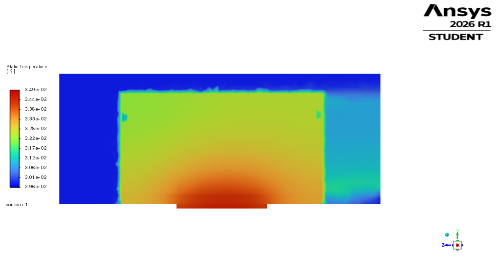
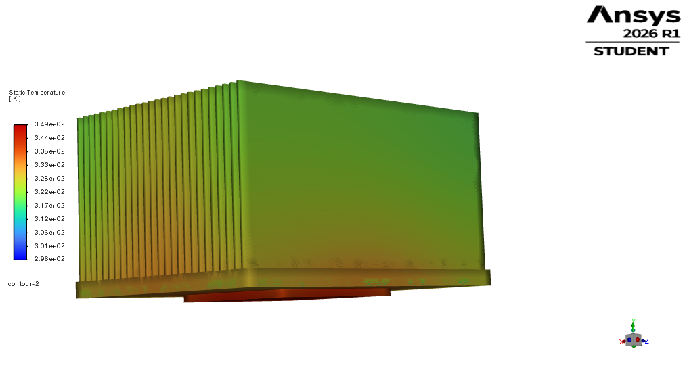
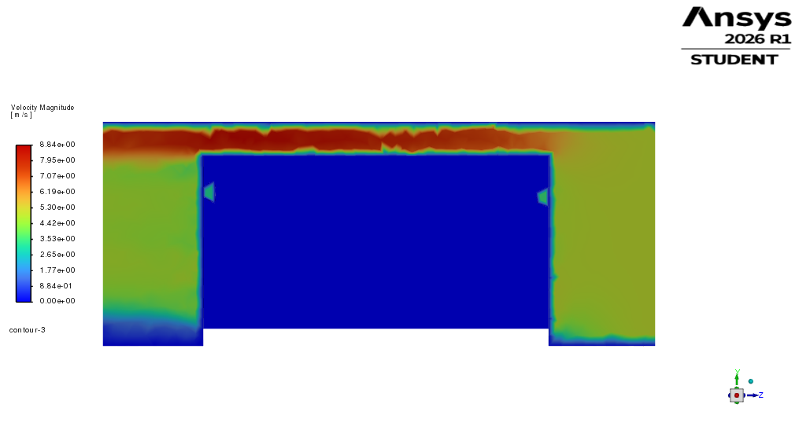
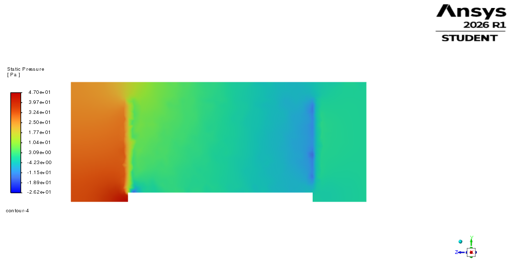

# CFD 0 Results: First-Pass Conjugate Heat-Transfer Simulation

## Purpose

This CFD case was created to check the selected forced-air heatsink concept from the analytical screening model.

The CFD model represents a simplified 250 W PCIe AI accelerator cooling case with a chip, TIM layer, aluminum heatsink base, fin array, and surrounding air domain.

This is a first-pass conjugate heat-transfer result, not a final mesh-independent industrial validation.

## CFD Setup Summary

| Item | Value |
|---|---:|
| Chip heat load | 250 W |
| Chip size | 45 mm × 45 mm × 2 mm |
| TIM thickness | 0.2 mm |
| TIM conductivity | 6 W/mK |
| Heatsink base | 80 mm × 100 mm × 5 mm |
| Base thickness | 5 mm |
| Fin height | 50 mm |
| Fin thickness | 1 mm |
| Fin spacing | 2 mm |
| Number of fins | 26 |
| Inlet air temperature | 25 °C |
| Inlet velocity | 5 m/s |
| Outlet pressure | 0 Pa gauge |
| Solver type | Steady conjugate heat transfer |
| Flow model | Laminar first-pass model |

## Stable CFD Result

The solution was continued from 200 to 700 iterations. The engineering quantities remained essentially unchanged between these two points.

| Quantity | Value |
|---|---:|
| Maximum chip temperature | 349.12 K = 75.97 °C |
| Average chip temperature | 345.15 K = 72.00 °C |
| Mass-weighted outlet temperature | 305.01 K = 31.86 °C |
| Inlet temperature | 298.15 K = 25.00 °C |
| Air temperature rise | 6.86 K |
| Mass flow rate | 0.03583 kg/s |
| Inlet static pressure | 28.80 Pa |
| Outlet static pressure | -0.009 Pa |
| Pressure drop | 28.8 Pa |
| Heat removed by air | approximately 248 W |
| Applied chip heat input | 250 W |
| Energy balance error | approximately 0.9% |

## Heat Balance Check

The air-side heat removal was estimated using the mass flow rate and the mass-weighted outlet temperature:

`Q_air = m_dot × cp × (T_out - T_in)`

Using:

| Quantity | Value |
|---|---:|
| m_dot | 0.03583 kg/s |
| cp_air | approximately 1007 J/kg-K |
| T_out | 305.01 K |
| T_in | 298.15 K |

This gives:

`Q_air ≈ 248 W`

The applied chip heat input was 250 W. Therefore, the heat-balance error was approximately 0.9%, which is acceptable for this first-pass CFD result.

## Comparison with Analytical Screening

The analytical screening model predicted a chip temperature of approximately 82.4 °C for the selected larger forced-air heatsink candidate.

The CFD result predicted a maximum chip temperature of approximately 76.0 °C.

| Quantity | Analytical estimate | CFD 0 result |
|---|---:|---:|
| Maximum / representative chip temperature | approximately 82.4 °C | approximately 76.0 °C |
| Pressure drop | approximately 30 Pa | approximately 28.8 Pa |

The CFD chip temperature is lower than the analytical estimate by about 6.4 °C. This is acceptable for a first-pass comparison because the analytical model was intentionally simplified and conservative.

The pressure-drop agreement is strong, with the CFD result close to the analytical estimate.

## CFD Contours

The following contours were extracted from the stable 700-iteration CFD 0 solution.

### Mid-plane Temperature Contour

The mid-plane temperature contour shows heat spreading from the chip through the TIM and aluminum heatsink base into the fin region. The maximum chip temperature from the CFD result was approximately 349.12 K, equal to 75.97 °C.

### Isometric Temperature Contour

The isometric temperature contour shows the 3D heatsink temperature distribution and the temperature gradient from the chip/base region toward the fin array.

### Mid-plane Velocity Contour

The velocity contour shows guided airflow through the air domain and around the heatsink region. This supports the forced-air cooling assumption used in the CFD 0 setup.

### Mid-plane Pressure Contour

The pressure contour supports the calculated pressure drop of approximately 28.8 Pa between inlet and outlet.

## Convergence Assessment

Although the continuity residual did not fully reach the default convergence target, the monitored engineering quantities were stable between 200 and 700 iterations.

The maximum chip temperature changed by less than 0.01 K, the outlet temperature remained effectively unchanged, and the pressure drop remained close to 28.8 Pa.

The energy balance error was below approximately 1%, which supports the physical consistency of the result.

For this reason, the solution was retained as a stable first coarse CFD result.

## Observed Reversed Flow at Outlet

A mild reversed-flow region was observed at the pressure outlet, affecting approximately 5% of the outlet area.

This was considered acceptable for the first coarse CFD run because the heat balance, mass balance, pressure drop, and chip temperature were stable.

However, the reversed flow indicates that the outlet boundary is likely too close to the heatsink wake. A longer downstream outlet extension is recommended for the next CFD refinement step.

## Result Interpretation

The first-pass CFD result supports the analytical screening conclusion that the selected larger forced-air heatsink concept can keep the 250 W chip below the 85 °C target under the assumed 5 m/s guided airflow condition.

The result also shows that the analytical model was useful as a conservative design-screening tool before setting up the 3D CFD model.

## Limitations

This CFD result should not be interpreted as final industrial validation.

Current limitations include:

- coarse first-pass mesh
- no mesh-independence study yet
- laminar first-pass flow assumption
- mild reversed flow at the pressure outlet
- simplified chip, TIM, and heatsink material properties
- simplified air-domain representation
- simplified guided-airflow boundary condition
- no experimental test correlation yet

## Recommended Next Refinements

Recommended next steps include:

1. extend the downstream outlet region to reduce reversed flow
2. refine the mesh in the fin channels and near solid-fluid interfaces
3. repeat the CFD run with a refined mesh
4. compare laminar and turbulence-model results, for example SST k-omega
5. perform a mesh-independence check
6. add board-level heat sources such as memory and VRM regions
7. define a physical validation plan using thermocouples, IR imaging, and airflow/pressure measurements

## Summary

The CFD 0 model provides a stable first-pass conjugate heat-transfer result for the selected forced-air heatsink concept.

The main result is:

| Quantity | Value |
|---|---:|
| Maximum chip temperature | approximately 75.97 °C |
| Target chip temperature | 85 °C |
| Pressure drop | approximately 28.8 Pa |
| Energy balance error | approximately 0.9% |

Therefore, under the assumed 5 m/s guided airflow condition, the selected 80 mm × 100 mm × 50 mm forced-air heatsink concept meets the chip temperature target in this first-pass CFD model.
