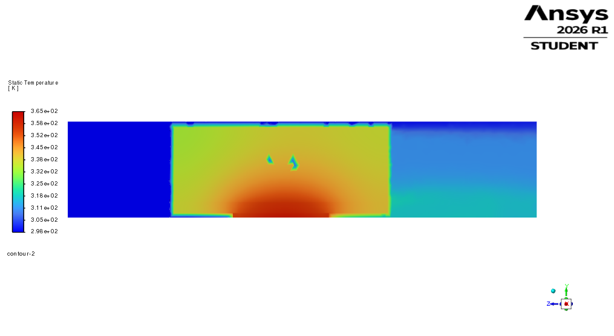
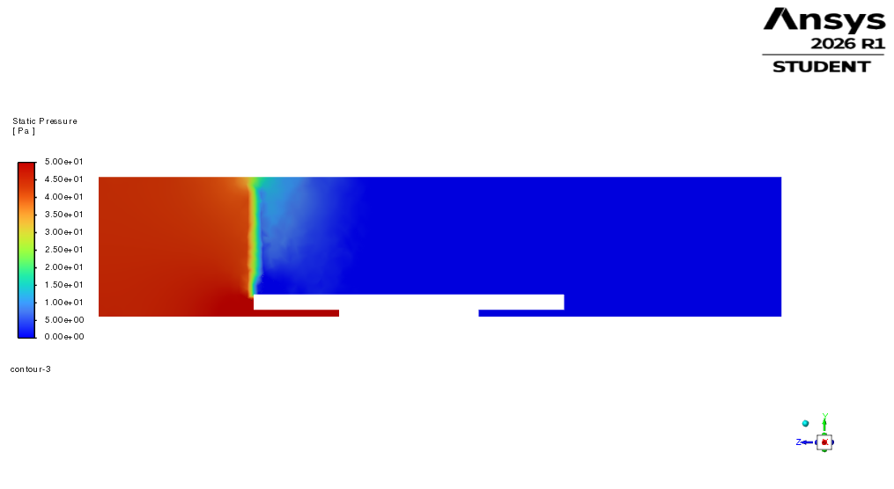

# CFD-2 Results: 80 × 100 × 35 mm Ducted Aluminium Heatsink

## Purpose

CFD-2 was performed to evaluate whether adding a ducted/shrouded air domain could improve the thermal performance of the 80 × 100 × 35 mm aluminium heatsink.

The previous CFD-1 case used the same heatsink geometry in an open/bypass air domain. CFD-1 showed that the design failed the 85°C maximum chip-temperature target, mainly because a large portion of the inlet flow bypassed the heatsink region.

CFD-2 therefore tested the same heatsink with a tighter ducted domain to reduce bypass and force more air through the fin region.

## Geometry

The heatsink geometry was kept the same as CFD-1:

| Parameter | Value |
|---|---:|
| Heatsink width | 80 mm |
| Heatsink length | 100 mm |
| Fin height | 35 mm |
| Base thickness | 5 mm |
| Fin thickness | 1 mm |
| Fin gap | 2 mm |
| Number of fins | 26 |
| Material | Aluminium |
| Chip power | 250 W |

The ducted air domain was reduced around the heatsink to guide flow through the fin region:

| Direction | Domain size |
|---|---:|
| X | -41 mm to +41 mm |
| Y | 0 mm to 45 mm |
| Z | 0 mm to 220 mm |

The flow direction was along the negative Z direction.

## Mesh

| Mesh quantity | Value |
|---|---:|
| Nodes | 69,511 |
| Elements | 174,558 |
| Maximum aspect ratio | 15 |
| Minimum element quality | 0.122 |
| Minimum orthogonal quality | 0.125 |

The mesh was accepted for a first-pass CFD comparison.

## Solver Setup

| Setting | Value |
|---|---|
| Solver | Pressure-based, steady |
| Viscous model | Laminar |
| Energy equation | On |
| Pressure-velocity coupling | SIMPLE |
| Spatial discretisation | Second order |
| Inlet velocity | 5 m/s |
| Inlet temperature | 298.15 K |
| Outlet pressure | 0 Pa gauge |
| Outer duct walls | No-slip, adiabatic |
| Chip heat generation | 6.17e7 W/m³ |

The simulation was run for 700 iterations.

## Numerical Results

| Quantity | CFD-2 result |
|---|---:|
| Maximum chip temperature | 360.92997 K = 87.78°C |
| Average chip temperature | 356.26738 K = 83.12°C |
| Outlet temperature | 309.08168 K = 35.93°C |
| Air temperature rise | 10.93 K |
| Inlet mass flow rate | 0.02260125 kg/s |
| Outlet mass flow rate | -0.022577662 kg/s |
| Mass imbalance | approximately 0.104% |
| Inlet static pressure | 44.533 Pa |
| Outlet static pressure | -0.0038 Pa |
| Pressure drop | approximately 44.54 Pa |
| Heat removed by air | approximately 248.4 W |
| Heat-balance error | approximately 0.6% |
| Reversed flow | approximately 1.7% of outlet area |

## Pressure-Drop Sanity Check

A simple analytical pressure-drop check was performed using a strict fin-gap approximation.

Assuming the airflow passes through the 25 internal 2 mm fin gaps:

| Quantity | Value |
|---|---:|
| Total volume flow rate | approximately 0.01845 m³/s |
| Internal fin-gap area | approximately 0.00175 m² |
| Estimated channel velocity | approximately 10.5 m/s |
| Hydraulic diameter | approximately 0.00378 m |
| Reynolds number | approximately 2640 |
| Estimated analytical pressure drop | approximately 61 Pa |

The CFD pressure drop was approximately 44.5 Pa. This is lower than the strict fin-gap estimate because the CFD model includes three-dimensional redistribution and small side/top clearances, which increase the effective flow area. The CFD pressure drop is therefore physically reasonable and of the same order as the analytical estimate.

## Discussion

Compared with CFD-1, ducting significantly improved the result.

| Case | Domain | Maximum chip temperature | Pressure drop | Result |
|---|---|---:|---:|---|
| CFD-1 | Open/bypass | 91.47°C | 12.7 Pa | Fail |
| CFD-2 | Ducted | 87.78°C | 44.54 Pa | Slight fail |

The pressure drop increased from approximately 12.7 Pa to 44.54 Pa, showing that the ducted domain forced more flow through the heatsink region. This reduced the maximum chip temperature from 91.47°C to 87.78°C.

However, the maximum chip temperature remained approximately 2.8°C above the 85°C target. Therefore, the 80 × 100 × 35 mm ducted aluminium heatsink was improved but still not fully acceptable.

## Figures

## Conclusion

CFD-2 demonstrated that ducting is beneficial because it reduces bypass and increases flow through the heatsink region. The ducted 80 × 100 × 35 mm aluminium heatsink reduced the maximum chip temperature by approximately 3.7°C compared with the open-domain case.

However, the maximum chip temperature remained above the 85°C target. This motivated the next design iteration, CFD-3, where the heatsink length was increased from 100 mm to 120 mm while keeping the lower 35 mm fin height.