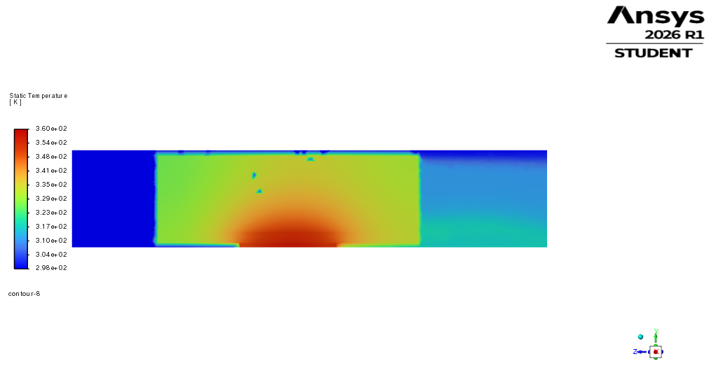
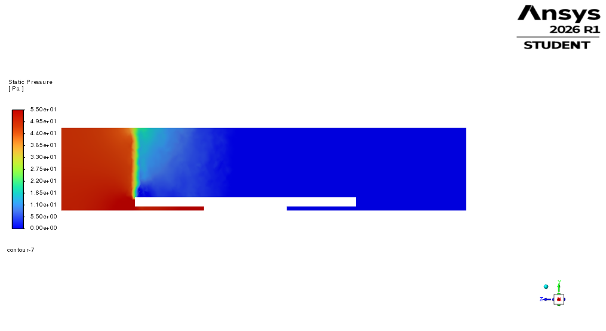
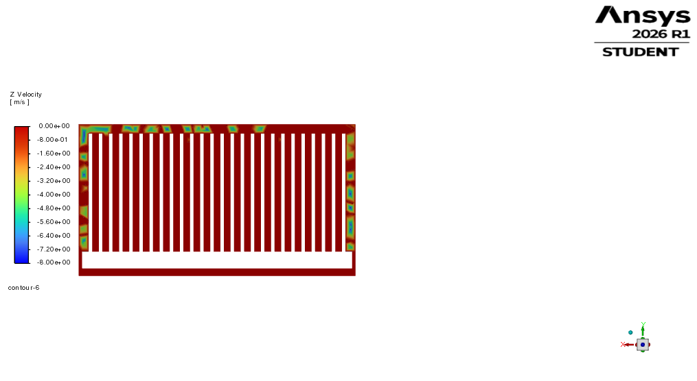

# CFD-3 Results: 80 × 120 × 35 mm Ducted Aluminium Heatsink

## Purpose

CFD-3 was performed as the next design iteration after CFD-2.

CFD-2 showed that ducting the 80 × 100 × 35 mm aluminium heatsink reduced bypass and improved cooling, but the maximum chip temperature was still above the 85°C target.

CFD-3 therefore increased the heatsink length from 100 mm to 120 mm while keeping the lower 35 mm fin height. The purpose was to check whether the remaining thermal margin could be recovered without returning to the taller 50 mm heatsink concept.

This case is treated as a thermal feasibility variant. Final acceptance would still require PCB layout, component keep-out, mounting, mass, and mechanical-envelope checks.

## Geometry

| Parameter | Value |
|---|---:|
| Heatsink width | 80 mm |
| Heatsink length | 120 mm |
| Fin height | 35 mm |
| Base thickness | 5 mm |
| Fin thickness | 1 mm |
| Fin gap | 2 mm |
| Number of fins | 26 |
| Material | Aluminium |
| Chip power | 250 W |

The heatsink was extended in the flow direction while keeping the chip and TIM fixed at the center region.

| Component | Z-location |
|---|---:|
| Chip/TIM | 97.5 mm to 142.5 mm |
| CFD-2 heatsink | 70 mm to 170 mm |
| CFD-3 heatsink | 60 mm to 180 mm |

The ducted air domain remained:

| Direction | Domain size |
|---|---:|
| X | -41 mm to +41 mm |
| Y | 0 mm to 45 mm |
| Z | 0 mm to 220 mm |

The flow direction was along the negative Z direction.

## Mesh

| Mesh quantity | Value |
|---|---:|
| Nodes | 79,689 |
| Elements | 187,932 |
| Maximum aspect ratio | 15 |
| Minimum element quality | 0.122 |
| Minimum orthogonal quality | 0.122 |

The mesh check identified a warning for degenerated distance vectors in the thin TIM zone. Since the TIM layer is only 0.2 mm thick and no negative volumes or material-interface errors remained, the mesh was accepted for this first-pass comparison.

## Solver Setup

| Setting | Value |
|---|---|
| Solver | Pressure-based, steady |
| Viscous model | Laminar |
| Energy equation | On |
| Pressure-velocity coupling | SIMPLE |
| Spatial discretisation | Second order |
| Inlet velocity | 5 m/s |
| Inlet temperature | 298.15 K |
| Outlet pressure | 0 Pa gauge |
| Outer duct walls | No-slip, adiabatic |
| Chip heat generation | 6.17e7 W/m³ |

The simulation was run for 700 iterations.

At 700 iterations, the residuals were:

| Residual | Value |
|---|---:|
| Continuity | 2.5974e-01 |
| X-velocity | 1.2291e-04 |
| Y-velocity | 8.0340e-05 |
| Z-velocity | 1.3123e-04 |
| Energy | 1.6400e-05 |

A small reversed-flow region was observed at the outlet, affecting approximately 1.1% of the outlet area. The heat balance and engineering quantities were stable enough for this first-pass design comparison.

## Numerical Results

| Quantity | CFD-3 result |
|---|---:|
| Maximum chip temperature | 356.67419 K = 83.52°C |
| Average chip temperature | 351.91735 K = 78.77°C |
| Outlet temperature | 309.11053 K = 35.96°C |
| Air temperature rise | 10.96 K |
| Inlet mass flow rate | 0.02260125 kg/s |
| Outlet mass flow rate | -0.022580839 kg/s |
| Mass imbalance | approximately 0.09% |
| Inlet static pressure | 49.021 Pa |
| Outlet static pressure | -0.0024 Pa |
| Pressure drop | approximately 49.02 Pa |
| Heat removed by air | approximately 249.1 W |
| Heat-balance error | approximately 0.36% |
| Reversed flow | approximately 1.1% of outlet area |

## Thermal Performance

The maximum chip temperature was below the target value.

| Quantity | Value |
|---|---:|
| Target maximum chip temperature | 85°C |
| CFD-3 maximum chip temperature | 83.52°C |
| Thermal margin | approximately 1.48°C |

Therefore, CFD-3 passed the maximum chip-temperature target.

## Comparison with CFD-2

| Case | Heatsink geometry | Domain | Maximum chip temperature | Pressure drop | Result |
|---|---|---|---:|---:|---|
| CFD-2 | 80 × 100 × 35 mm | Ducted | 87.78°C | 44.54 Pa | Slight fail |
| CFD-3 | 80 × 120 × 35 mm | Ducted | 83.52°C | 49.02 Pa | Pass |

Increasing the heatsink length from 100 mm to 120 mm reduced the maximum chip temperature by approximately:

87.78 - 83.52 = 4.26°C

The pressure drop increased moderately:

49.02 - 44.54 = 4.48 Pa

This shows that the longer heatsink recovered the missing thermal margin with only a modest pressure-drop penalty.

## Figures

## Discussion

CFD-3 confirms that the CFD-2 design was close to the required cooling performance, but lacked sufficient heat-transfer area. Extending the heatsink length increased the available fin and base surface area while maintaining the mechanically more attractive 35 mm fin height.

The Z-velocity contour near the fin entrance shows that the ducted configuration guides airflow through the fin passages. The pressure contour shows the expected pressure decrease through the ducted heatsink region, and the temperature contour shows chip heat spreading through the TIM, base, and fins before being removed by forced airflow.

Compared with CFD-2, the longer heatsink reduced the maximum chip temperature from 87.78°C to 83.52°C. This corresponds to a reduction of approximately 4.26°C. The pressure drop increased only moderately, from 44.54 Pa to 49.02 Pa.

This result shows that increasing heatsink length is a useful design option when height is constrained.

## Conclusion

CFD-3 produced the first lower-height aluminium heatsink configuration that passed the 85°C maximum chip-temperature target in the simplified ducted CFD model.

The final CFD-3 result was:

- Heatsink: 80 × 120 × 35 mm aluminium
- Inlet flow: 5 m/s ducted airflow
- Chip heat load: 250 W
- Maximum chip temperature: 83.52°C
- Average chip temperature: 78.77°C
- Pressure drop: 49.02 Pa
- Heat-balance error: approximately 0.36%
- Result: PASS

This result supports the design decision that increasing heatsink length is a viable way to recover thermal margin while avoiding the mechanically more aggressive 50 mm fin-height design.

However, this remains a first-pass thermal feasibility result. Further validation would require mesh sensitivity, turbulence or transition assessment, detailed PCB layout checks, mechanical support evaluation, and experimental correlation.