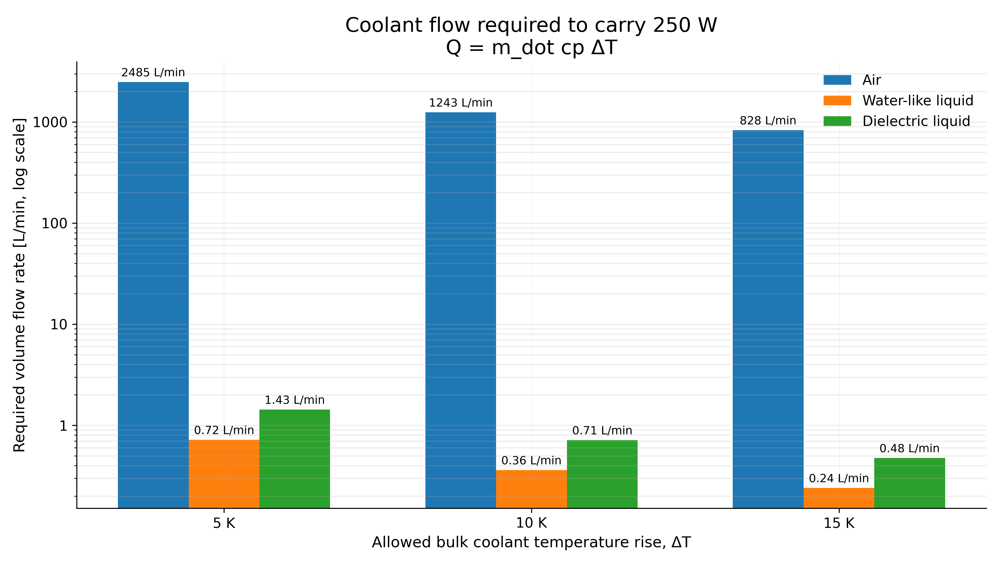
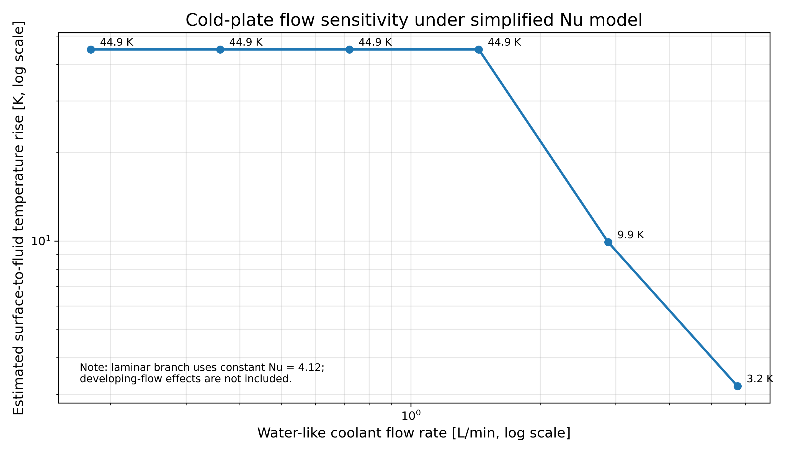
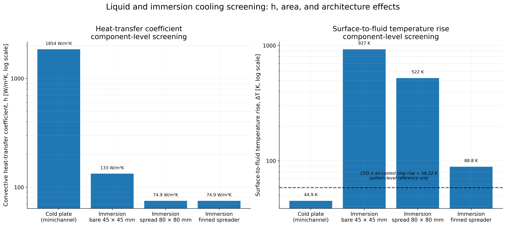
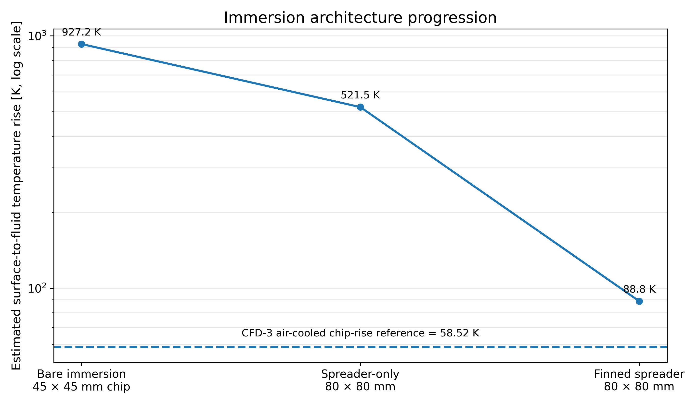

# Liquid and Immersion Cooling Screening Extension

## Purpose

This extension adds a first-pass liquid and immersion cooling screening study to the 250 W PCIe AI accelerator thermal-design workflow.

The aim is not to design a final liquid-cooled or immersion-cooled product. Instead, the goal is to compare the main cooling physics using simple first-principles calculations and empirical heat-transfer correlations:

- coolant heat-carrying capacity,
- direct-to-chip cold-plate convection,
- bare single-phase immersion,
- heat spreading in immersion,
- wetted-area enhancement using an idealized finned immersed heat spreader.

This extension was added to connect the original air-cooled PCIe accelerator project to liquid-cooling and immersion-cooling design questions relevant to high-power AI and HPC hardware.

---

## Scope and limitations

This study is a screening-level model only.

It does **not** represent:

- a validated liquid-cooling product design,
- an immersion-tank CFD model,
- a full chip junction-temperature prediction,
- a pump-selected operating point,
- a pressure-drop-optimized cold plate,
- a mechanically packaged solution,
- an experimental validation study.

The air-cooled CFD-3 case is a system-level ANSYS Fluent conjugate heat-transfer result. It includes the chip, TIM, heatsink, and airflow. The liquid and immersion cases are component-level convective estimates. Therefore, the CFD-3 result is shown only as a contextual reference, not as a directly equivalent bar in the component-level comparison.

---

## Design target

| Quantity | Value |
|---|---:|
| Chip heat load | 250 W |
| Chip footprint | 45 mm × 45 mm |
| Chip area | 0.002025 m² |
| Chip heat flux | 123,457 W/m² |
| Chip heat flux | 12.35 W/cm² |
| Air inlet temperature | 25 °C |
| Air-cooled CFD-3 maximum chip temperature | 83.52 °C |
| Air-cooled CFD-3 chip rise above inlet | 58.52 K |
| Air-cooled CFD-3 pressure drop | 49.02 Pa |

---

## Representative fluid properties

The fluid properties are representative screening values and are not tied to one commercial coolant product.

| Fluid | Density [kg/m³] | cp [J/kgK] | Dynamic viscosity [Pa·s] | Thermal conductivity [W/mK] |
|---|---:|---:|---:|---:|
| Air | 1.20 | 1006 | 1.85e-5 | 0.026 |
| Water-like coolant | 997 | 4180 | 8.90e-4 | 0.60 |
| Representative dielectric liquid | 1400 | 1500 | 4.00e-3 | 0.12 |

The air and water-like values are representative near-room-temperature engineering values. The dielectric-liquid values are representative assumptions for screening only and should be replaced by a specific coolant datasheet in a detailed product model.

---

## Part A: Coolant heat-carrying capacity

The required coolant flow rate was estimated using:

```text
Q = m_dot cp ΔT
```

where:

- `Q` is the heat load,
- `m_dot` is the coolant mass flow rate,
- `cp` is the specific heat capacity,
- `ΔT` is the allowed bulk coolant temperature rise.

For a 250 W heat load, the required volume flow was compared for allowed bulk coolant temperature rises of 5 K, 10 K, and 15 K.

At 10 K bulk coolant temperature rise:

| Fluid | Required volume flow |
|---|---:|
| Air | 1242.54 L/min |
| Water-like coolant | 0.360 L/min |
| Representative dielectric liquid | 0.714 L/min |

The volume-flow difference is large because liquids have much higher volumetric heat capacity than air.



### Interpretation

Liquid coolants can carry the same 250 W heat load with far lower volumetric flow than air. However, this only describes the coolant heat-carrying capacity. It does not by itself predict chip temperature. Chip-level temperature also depends on heat-transfer coefficient, wetted area, conduction resistance, thermal spreading, and flow distribution.

---

## Part B: Direct-to-chip cold-plate screening

A simple direct-to-chip minichannel cold plate was estimated using a water-like coolant.

### Geometry

| Parameter | Value |
|---|---:|
| Active region | approximately 50 mm × 50 mm |
| Number of channels | 10 |
| Channel width | 2 mm |
| Channel height | 1 mm |
| Channel length | 50 mm |
| Hydraulic diameter | 1.333 mm |
| Coolant bulk rise basis | 10 K |

### Baseline result

| Quantity | Value |
|---|---:|
| Water-like coolant flow | 0.360 L/min |
| Channel velocity | 0.300 m/s |
| Reynolds number | 448 |
| Prandtl number | 6.20 |
| Nusselt number | 4.12 |
| Heat-transfer coefficient | 1854 W/m²K |
| Wetted heat-transfer area | 0.003 m² |
| Estimated surface-to-fluid temperature rise | 44.95 K |

The baseline cold-plate estimate uses a simplified fully developed laminar rectangular-duct Nusselt number. It is useful as a first-pass estimate, but it is not an optimized cold-plate design.

The approximate thermal entrance length is:

```text
L_th ≈ 0.05 Re Pr Dh
```

For the baseline case:

| Quantity | Value |
|---|---:|
| Thermal entrance length | 185.2 mm |
| Channel length | 50.0 mm |
| Entrance-length / channel-length ratio | 3.70 |

This means the thermal entrance length is larger than the physical channel length. Therefore, developing-flow effects may be important, and the simplified constant-Nusselt-number model should not be treated as a final cold-plate prediction.

---

## Part C: Cold-plate flow sensitivity

The cold-plate flow sensitivity varies the water-like coolant flow around the 10 K bulk-rise baseline case.

| Flow multiplier | Water flow [L/min] | Equivalent bulk coolant ΔT [K] | Re | Nu | Surface-to-fluid ΔT [K] | Regime |
|---:|---:|---:|---:|---:|---:|---|
| 0.5 | 0.180 | 20.0 | 224 | 4.12 | 44.95 | Laminar |
| 1.0 | 0.360 | 10.0 | 448 | 4.12 | 44.95 | Laminar |
| 2.0 | 0.720 | 5.0 | 896 | 4.12 | 44.95 | Laminar |
| 4.0 | 1.440 | 2.5 | 1792 | 4.12 | 44.95 | Laminar |
| 8.0 | 2.879 | 1.25 | 3584 | 18.70 | 9.90 | Transitional screening |
| 16.0 | 5.759 | 0.625 | 7168 | 57.94 | 3.20 | Turbulent |



### Interpretation

Under the simplified fully developed laminar constant-Nusselt-number assumption, increasing flow does not change the estimated cold-plate convective coefficient while the flow remains laminar. This is a modelling limitation, not a general design rule.

In a real short minichannel cold plate, developing thermal boundary layers, entrance effects, manifolds, pressure drop, and flow maldistribution may cause the heat-transfer coefficient to depend on flow rate. Therefore, this sensitivity plot should be treated as a screening illustration only.

---

## Part D: Single-phase immersion screening

Three single-phase dielectric immersion cases were considered:

1. bare 45 mm × 45 mm chip-area immersion,
2. idealized 80 mm × 80 mm spreader-only immersion,
3. idealized 80 mm × 80 mm finned immersed heat spreader.

The dielectric flow baseline corresponds to a 10 K bulk coolant temperature rise:

| Quantity | Value |
|---|---:|
| Dielectric flow rate | 0.714 L/min |
| Flow passage height | 10 mm |

### Case D1: Bare chip-area immersion

| Quantity | Value |
|---|---:|
| Heated area | 0.002025 m² |
| Velocity | 0.0265 m/s |
| Reynolds number | 416.7 |
| Heat-transfer coefficient | 133.2 W/m²K |
| Estimated surface-to-fluid temperature rise | 927.2 K |

Bare chip-area immersion is a conservative lower-bound reference. It is not sufficient for this 250 W heat load in the simplified single-phase forced-convection model.

### Case D2: Spreader-only immersion

| Quantity | Value |
|---|---:|
| Spreader footprint | 80 mm × 80 mm |
| Heated area | 0.0064 m² |
| Velocity | 0.0149 m/s |
| Reynolds number | 416.7 |
| Heat-transfer coefficient | 74.9 W/m²K |
| Estimated surface-to-fluid temperature rise | 521.5 K |

Spreading the heat from the chip footprint to an 80 mm × 80 mm area reduces heat flux, but a flat immersed spreader alone is still not enough under the assumed dielectric flow supply.

### Case D3: Finned immersed heat spreader

An idealized finned immersed spreader was added to estimate the benefit of increasing wetted area.

| Quantity | Value |
|---|---:|
| Spreader footprint | 80 mm × 80 mm |
| Fin material | Aluminium |
| Fin conductivity | 200 W/mK |
| Number of fins | 20 |
| Fin height | 10 mm |
| Fin thickness | 1 mm |
| Fin pitch | 4 mm |
| Fin length | 80 mm |
| Fin efficiency | 0.976 |
| Effective heat-transfer area | 0.03759 m² |
| Estimated surface-to-fluid temperature rise | 88.8 K |

The finned immersion case strongly reduces the predicted surface-to-fluid temperature rise compared with bare and spreader-only immersion. However, it is still an idealized effective-area estimate. It does not resolve inter-fin channel flow, pressure drop, flow bypass, tank circulation, or vapor-chamber internal resistance.

---

## Liquid and immersion convective screening

The following figure compares the component-level convective screening results. The air-cooled CFD-3 result is shown only as a dashed system-level reference line.



### Interpretation

The comparison shows that coolant heat capacity alone is not enough. Local heat-transfer coefficient, wetted area, and architecture are critical.

The cold plate has the highest heat-transfer coefficient in this screening model. Bare chip-area immersion performs poorly because it combines modest single-phase dielectric convection with a small heat-transfer area. The spreader-only immersion case increases area but remains limited. The finned immersed spreader provides a major improvement by increasing effective wetted area, although it remains an idealized estimate.

---

## Immersion architecture progression

The immersion-only progression is:

```text
Bare chip immersion → flat heat spreader → finned immersed spreader
```



This progression is useful because it avoids a misleading comparison between an optimized liquid case and an unoptimized immersion case. It shows the internal design logic of immersion cooling: the thermal architecture must move from simple liquid contact toward enhanced surfaces and directed flow.

---

## Part E: Immersion directed-flow sensitivity

The immersion flow sensitivity varies the dielectric flow rate around the 10 K bulk-rise baseline case.

| Flow multiplier | Dielectric flow [L/min] | Equivalent bulk coolant ΔT [K] |
|---:|---:|---:|
| 0.5 | 0.357 | 20.0 |
| 1.0 | 0.714 | 10.0 |
| 2.0 | 1.429 | 5.0 |
| 4.0 | 2.857 | 2.5 |

These are sensitivity points, not pump-selected operating points.

At the highest investigated dielectric flow case, the finned immersion heat spreader gives an estimated surface-to-fluid temperature rise of approximately 44.4 K. This is much better than bare immersion, but it is still a screening result and does not include pressure-drop design, fin-channel flow resolution, mechanical integration, or test correlation.

---

## Main findings

1. Liquid coolants require far lower volumetric flow than air to carry the same 250 W heat load.
2. Coolant heat-carrying capacity alone does not predict chip temperature.
3. Direct-to-chip water-like cold-plate cooling gives a much higher heat-transfer coefficient than the simplified dielectric immersion cases.
4. Bare chip-area immersion is not sufficient for this 250 W heat flux in the simplified single-phase forced-convection model.
5. Spreading heat to a larger immersed surface helps, but a flat spreader alone remains limited.
6. Adding fins and accounting for fin efficiency greatly reduces the estimated immersion surface-to-fluid temperature rise.
7. Cold-plate flow sensitivity is strongly affected by the simplified Nusselt-number model; developing-flow effects may matter.
8. The air-cooled CFD-3 result is a system-level CFD reference and should not be treated as directly equivalent to the component-level convective estimates.
9. The extension is useful as a physics-based screening workflow, not as a validated liquid-cooling or immersion-cooling product design.

---

## Interview-safe conclusion

This extension shows that liquid cooling is not only about coolant heat capacity. Although liquids can carry 250 W with far lower volumetric flow than air, the chip-level thermal result depends strongly on local heat-transfer coefficient, wetted area, and cooling architecture.

In the simplified model, bare dielectric immersion over the chip footprint is not sufficient for a 250 W AI accelerator chip. Heat spreading improves the result, but a flat spreader alone remains limited. An idealized finned immersed heat spreader significantly reduces the estimated surface-to-fluid temperature rise, showing why practical immersion systems require enhanced surfaces, directed flow, pressure-drop design, mechanical integration, and experimental validation.

---

## Files generated

```text
python/liquid_cooling_screening.py
python/plot_liquid_cooling_clean_figures.py

results/flow_rate_comparison.csv
results/h_screening_summary.csv
results/cold_plate_flow_sensitivity.csv
results/immersion_velocity_sensitivity.csv

figures/liquid_flow_required.png
figures/liquid_convective_screening.png
figures/immersion_architecture_progression.png
figures/cold_plate_flow_sensitivity.png
```
