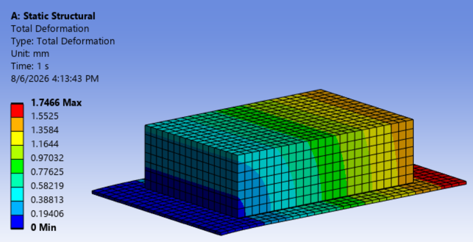
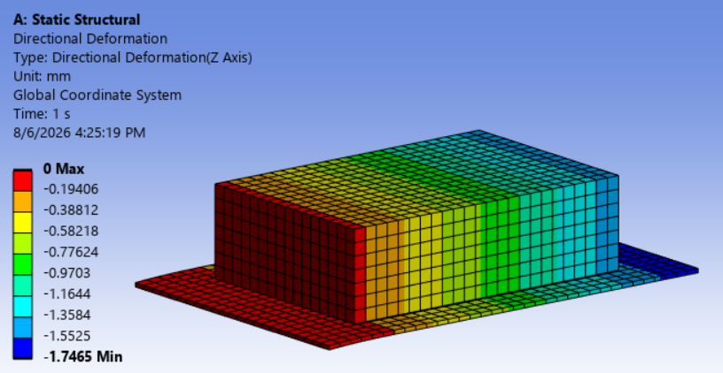
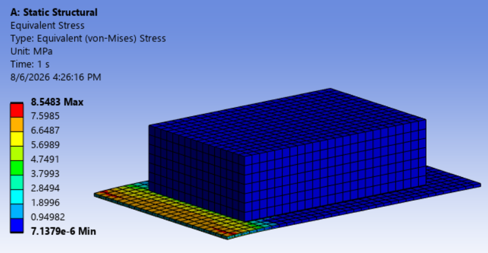
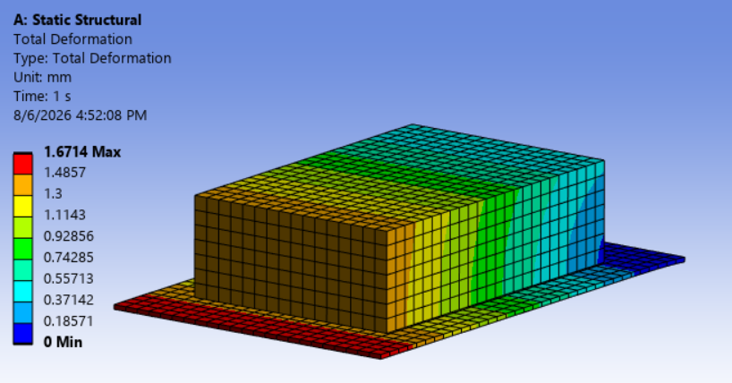
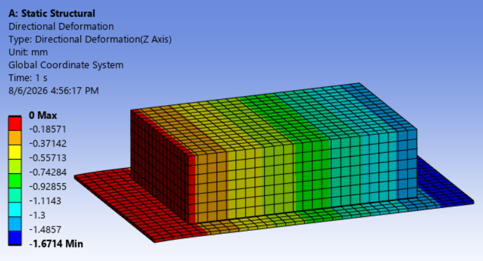
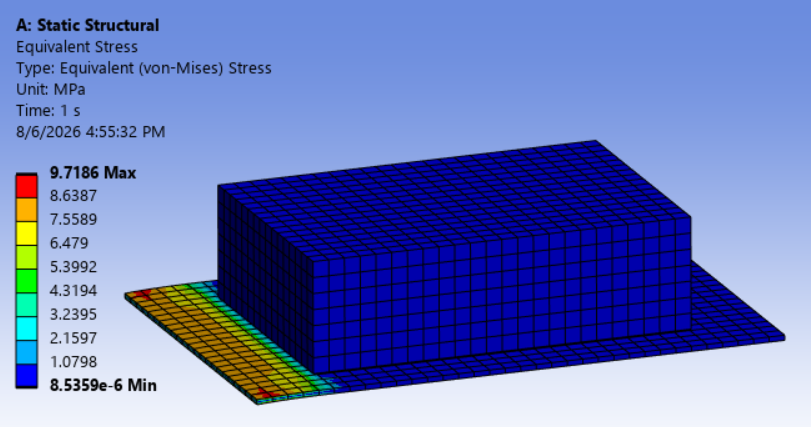
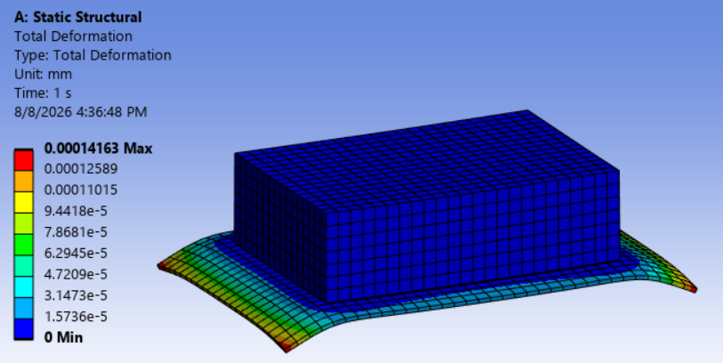
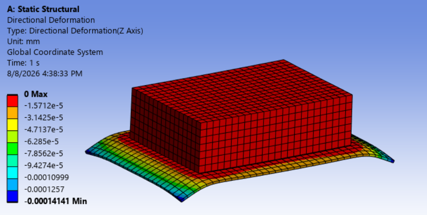
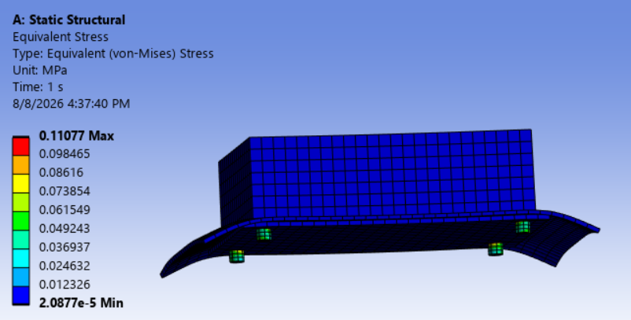

# Thermo-Mechanical Support Study of a 250 W PCIe Accelerator Heatsink Assembly

This folder documents a simplified static structural study of the PCB/heatsink support concept for the 250 W PCIe-style AI accelerator thermal design project.

The thermal CFD study identified an 80 × 120 × 35 mm ducted aluminium heatsink as a first-pass thermally feasible concept. This mechanical study checks whether such a heatsink mass can reasonably be supported by the PCB alone, or whether additional mechanical support such as a backplate and standoffs is required.

The study was performed in ANSYS Mechanical as a concept-level static structural comparison. It is not intended as a detailed PCB laminate model, PCIe compliance assessment, shock/vibration analysis, or final product validation.

---

## Objective

The objective of this study is to compare three simplified mechanical support concepts:

| Case | Support concept | Purpose |
|---|---|---|
| Case A | Unsupported PCB + equivalent heatsink mass | Baseline bending case |
| Case B | PCB + heatsink + bonded aluminium backplate | Check effect of local backplate stiffening |
| Case C | PCB + heatsink + backplate + four standoff supports | Check chassis-supported load path |

The key question is:

> Does the thermally feasible heatsink require additional mechanical support to reduce PCB bending?

---

## Simplified Geometry

The model represents a simplified PCIe-style accelerator card assembly.

| Component | Approximate dimensions |
|---|---:|
| PCB | 167.65 × 111.15 × 1.6 mm |
| Heatsink equivalent block | 120 × 80 × 35 mm |
| Backplate | 130 × 90 × 2 mm |
| Standoffs | 4 cylinders, 6 mm diameter, 5 mm height |

The heatsink is represented as an equivalent solid block with adjusted density so that its mass matches the estimated heatsink mass from the thermal design.

---

## Materials

| Component | Material representation |
|---|---|
| PCB | FR4-like linear elastic material |
| Heatsink equivalent block | Aluminium stiffness with equivalent density |
| Backplate | Aluminium |
| Standoffs | Aluminium |

The heatsink equivalent density was adjusted to represent a heatsink mass of approximately 424 g rather than treating the full block as solid aluminium.

---

## Boundary Conditions and Loading

A static gravity load was applied in the negative Z direction.

The three cases use different support assumptions:

### Case A: Unsupported PCB + Heatsink

The PCB is fixed at one short end face. The heatsink load is carried mainly by the PCB, producing cantilever-like bending.

### Case B: Backplate Support

A bonded aluminium backplate is added below the PCB. The fixed support condition remains the same as Case A to isolate the effect of local backplate stiffening.

### Case C: Four-Standoff Support

Four standoffs are added below the backplate near the loaded region. The bottom faces of the standoffs are fixed, representing a chassis-supported or mechanically supported load path.

The intended load path in Case C is:

```text
Heatsink load → PCB/backplate → standoffs → fixed base/chassis
```

---

## Results Summary

| Case | Support concept | Maximum total deformation | Maximum Z deformation | Maximum von Mises stress |
|---|---|---:|---:|---:|
| Case A | Unsupported PCB + heatsink | 1.7466 mm | -1.7465 mm | 8.5483 MPa |
| Case B | Backplate only | 1.6714 mm | -1.6714 mm | 9.7186 MPa |
| Case C | Backplate + 4 standoffs | 0.00014163 mm | -0.00014141 mm | 0.11077 MPa |

---

## Case A: Unsupported PCB + Heatsink

Case A represents the heatsink mounted on the PCB with one short PCB end face fixed. This produces a cantilever-like bending response.

The maximum total deformation is approximately 1.75 mm, showing that the PCB is mechanically sensitive to the heatsink mass when no additional support is provided.







---

## Case B: Backplate Support

Case B adds a bonded aluminium backplate below the PCB. The maximum total deformation decreases slightly from 1.7466 mm to 1.6714 mm.

This indicates that the backplate provides some local stiffening, but the improvement is modest because the assembly is still mainly supported through the PCB edge.

The maximum equivalent stress increases slightly from 8.5483 MPa to 9.7186 MPa, indicating that the bonded backplate changes the local load path and stress distribution near the support region.







---

## Case C: Backplate + Four Standoffs

Case C adds four standoff supports below the backplate. The bottom faces of the standoffs are fixed, representing a chassis-supported load path.

This strongly reduces deformation and stress compared with Cases A and B.

The maximum total deformation decreases from 1.7466 mm in Case A to 0.00014163 mm in Case C. The maximum equivalent stress decreases from 8.5483 MPa to 0.11077 MPa.

This shows that a direct support path through standoffs or a chassis-supported structure is much more effective than relying on the PCB alone.







---

## Engineering Interpretation

The unsupported and backplate-only cases both show PCB bending on the order of 1.7 mm. The backplate alone gives only a small reduction in deformation.

The four-standoff concept provides a much stronger structural load path. This confirms that the thermally feasible heatsink should not be treated as a free-standing PCB-mounted mass.

A practical mechanical design would likely require one or more of the following:

- backplate support
- standoff supports
- heatsink bracket
- chassis-supported duct or shroud
- additional PCB support near the heatsink region

---

## Limitations

This is a simplified concept-level structural screening model. The following effects were not included:

- detailed PCB laminate stack-up
- copper layers and local component stiffness
- screw preload
- contact nonlinearity
- plasticity
- shock and vibration loading
- PCIe connector mechanical compliance
- manufacturing tolerances
- thermal expansion and coupled thermo-mechanical loading
- experimental validation

Therefore, the results should be interpreted as a support-concept comparison, not as a final validated mechanical design.

---

## Conclusion

The simplified static structural study shows that the final ducted heatsink concept is mechanically support-sensitive.

The unsupported PCB case produces approximately 1.75 mm maximum deformation. Adding a backplate alone reduces deformation only slightly. Adding four standoff supports reduces deformation by several orders of magnitude and creates a much more effective load path.

The main conclusion is:

> The heatsink concept may be thermally feasible, but it should be paired with a mechanical support strategy such as standoffs, a backplate, a bracket, or chassis-supported ducting before being considered a realistic product-level design.

---

## Status

This study is part of a portfolio-level mechanical and thermal design workflow for a simplified 250 W PCIe AI accelerator card.
